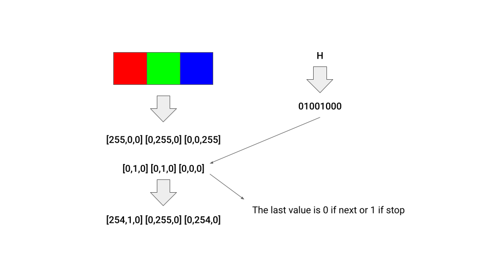

# What is xphoto?

Xphoto is command line tool which allows you to encode data inside a picture. The data may vary from simple text messages to other files.

The encoding works like this:

1. Each character in the data is converted into 8-bit binary.
2. For each character we take three pixels of the image and change the rgb values so they represent our character in binary.

The decoding works in reverse by reading the rgb values and transforming them into binary and then into characters.

